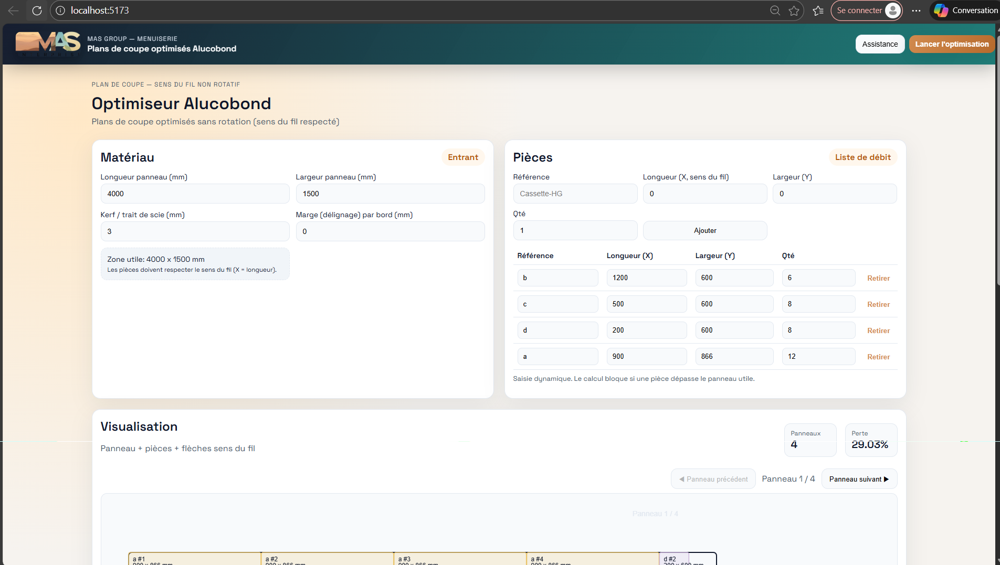
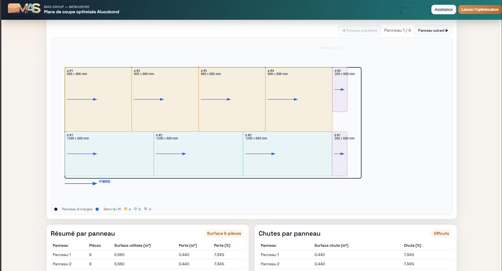

# Alucobond Cutting Optimization

Public portfolio presentation of a full-stack application that optimizes composite-panel cutting plans and supports project, supplier and reusable-stock workflows.

> This repository contains documentation and static screenshots approved for public portfolio presentation. The optimization implementation, professional source code, customer data and generated manufacturing documents remain private.

## Project overview

The solution converts panel dimensions, cutting margins and required parts into optimized placement plans. It respects material orientation while connecting technical planning with project, purchasing and offcut-stock processes.

## Business goals

- Reduce material waste and manual planning effort.
- Respect orientation and non-rotation manufacturing constraints.
- Produce clear visual plans for fabrication teams.
- Connect project requirements to supplier and stock decisions.
- Automate technical and commercial document generation.

## Main capabilities

- panel, margin and cutting-width configuration;
- dynamic part entry with quantities and references;
- constrained placement optimization without rotation;
- scaled visualization of panels and placed parts;
- panel usage and waste-percentage calculation;
- project, block, measurement and reference tracking;
- supplier-plan and fabrication-order preparation;
- stock-lot, movement and reusable-offcut management;
- DXF, CSV, PDF and spreadsheet exports.

## Technology overview

| Area | Technologies |
| --- | --- |
| Web interface | React, Vite, canvas visualization |
| Backend | Python, FastAPI, Pydantic |
| Optimization | Rectangle-packing and constraint-solving tools |
| Data | Microsoft SQL Server, ODBC |
| Documents | DXF, PDF and spreadsheet generation |

## Architecture

See [docs/architecture.md](docs/architecture.md) for the sanitized technical overview.

## Screenshots

### Optimization workspace

### Generated cutting plan

### Panel summary

## My contribution

- translated an industrial cutting problem into software constraints;
- developed the React visualization and FastAPI business services;
- integrated optimization, persistence and document-generation tools;
- modeled project, supplier and stock workflows;
- delivered technical outputs for downstream manufacturing activities.

## Skills demonstrated

`React` · `Python` · `FastAPI` · `Optimization Algorithms` · `Canvas Visualization` · `SQL Server` · `DXF/PDF/Excel` · `Industrial UX`

## Confidentiality

No internal algorithm implementation, source file, customer record, price, order, database information or manufacturing document is included. The published images are static interface captures approved for portfolio use.

## License

The documentation and anonymized visuals are governed by [LICENSE](LICENSE).
