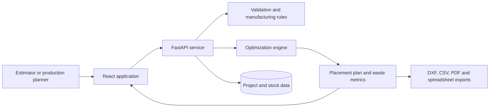

# Sanitized architecture overview

## Logical view



## Optimization flow

```text
Panel definition
    → part validation
    → orientation and margin constraints
    → placement optimization
    → waste calculation
    → visual and document outputs
```

## Design considerations

- Material orientation is preserved where rotation is not allowed.
- Cutting width and safety margins reduce the usable panel area.
- Validation prevents impossible parts from entering optimization.
- Placement results remain connected to project and stock context.
- Export generation is separated from the core placement result.

## Public-scope limitations

The exact algorithms, scoring rules, data schemas, customer references and generated production documents are intentionally omitted.

## Screenshot safety

- Use invented dimensions and references.
- Avoid real customer, project and supplier information.
- Remove logos and document metadata.
- Confirm that no browser URL or internal hostname is visible.
